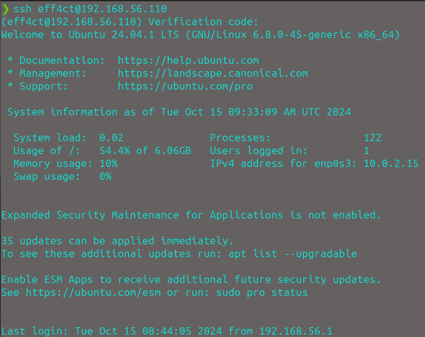

# 1. Télécharger et créer une vm ubuntu server sans interface graphique

Création de la VM avec l'ISO de Ubuntu Server installer préalablement sur notre machine, puis nous nous connectons à la VM.

# 2. Mettez en place une 2ème carte réseaux et faites en sorte que ssh fonctionne

Commandes utilisés : 

- `sudo nano /etc/netplan/50-cloud-init.yaml` (modification du fichier de config en rajoutant dhcp4: true sur notre nouvelle carte réseau)

- `sudo apt install openssh-server` (installation de ssh)

- `sudo systemctl enable ssh` (enable le serveur)

- `sudo systemctl status ssh` (vérifier le satut)

- `ssh <USER>@<IP_MACHINE>` (connexion en ssh à la VM depuis notre terminal)

# 3. Créer un serveur web avec le contenu dans la notion fourni

Commandes utilisés :

- `sudo apt install apache2` (installation du service apache)

- `sudo systemctl status apache2` (vérification du service apache)

- `sudo systemctl restart apache2` (redémarrage du service pour prendre en compte les modifications)

- `sudo nano /var/www/html/index.html` (modification avec le code fourni)

# 4. Faites en sorte d'authoriser que les ports 22 et 80 

Commandes utilisés :

- `sudo ufw status` (vérifier le statut, dans mon cas il est inactive je l'active donc)

- `sudo ufw enable` (activer le service)

- `sudo ufw allow 22/tcp` & `sudo ufw allow 80/tcp` (authorisation que des ports 22 et 80)

- `sudo ufw status` (pour vérifier que seul les ports 22 et 80 sont authorisés)

# Sécuriser SSH

Pour ce faire nous allons avoir besoin d'abord de générer une clé ssh :

- `ssh-keygen -t rsa -b 4096`

Ensuite copions la clef publique sur le serveur distant :

- `ssh-copy-id <user>@<IP_MACHINE>`

Connectons nous au serveur distant via ssh :

- `ssh <user>@<IP_MACHINE>`

Cette commande permet de te connecter au serveur distant en utilisant ton authentification par clé SSH.

Modification du fichier de configuration SSH (ssh_config) :

- `sudo nano /etc/ssh/sshd_config`

Changer les lignes `#PasswordAuthentication yes` et `#PubkeyAuthentification yes` en `PasswordAuthentification no` et `PubkeyAuthentification yes`

Effectuons un `grep -v -e "#" /etc/ssh/sshd_config` pour rechercher dans le fichier les seules lignes qui ne sont pas en # et vérifier notre configuration :

# Bonus :

# 6. Ajoutez du MFA (google authentificator) sur SSH -> Si fail, alerte discord

## A. Configurer google authentificator sur notre serveur

Démarche & commandes utilisés :

- `sudo apt install libpam-google-authenticator` (installation du module PAM google authentificateur)

- On ajoute cette ligne à la fin du fichier de configuration de PAM `auth required pam_google_authenticator.so` qui est dans `/etc/pam.d/sshd`

- On redémarre le service ssh pour prendre les modifications en compte : 
    - `sudo systemctl restart sshd.service`

- On modifie le fichier de config de SSH et on modifie la ligne `ChallengeResponseAuhtentication no` en `ChallengeResponseAuhtentication yes` et on commente la ligne `@include common-password`

On essaye de se conencter en SSH et BAM ça marche :

## B. Configurer l'alerte de fail

(EN PLEIN DEBUGGING)

