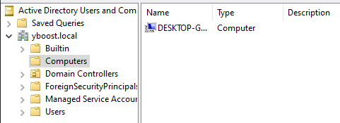
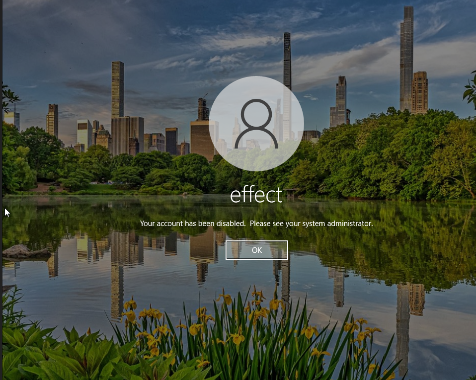
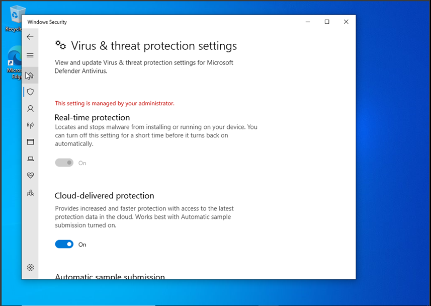

# Partie 1

## 1 - Créer un nouvel utilisateur dans le domaine, je veux que vous me détailler comment vous avez fait.

- Dans un premier temps j'ai utilisé l'application qui s'appelle "Active Directory Users and Computers” sur mon DC. 

- Ensuite je suis aller dans notre active directory et j'ai été dans les users et j'ai fais New -> User et j'ai rentrer les infos de notre nouveau User. 

Notre User :
- 

## 2 - Donnez moi aussi une commande powershell pour créer un 2eme utilisateur

commande à utiliser : `New-LocalUser -Name "NomUtilisateur2" -Password (ConvertTo-SecureString "MotDePasse" -AsPlainText -Force)
`

## 3 - Joignez le PC au domaine

Le pc à bien été ajouter à mon DC:

## 4 - Désactiver le compte par défaut que vous avez créer lors du setup du PC

Comme mes deux comptes (compte de domaine et local) ont le même nom quand je me co à "effect" quand je démarre mon ordi c'était mon compte de domaine pour basculer sur la connexion de mon compte local "effect"
je devais choisir autre utilisateur et mettre ./ dans mon nom d'utilisateur et le mot de passe (cela explique pourquoi il y a marqué "autre utilisateur" au lieu de "effect"). 

## 5 - Faites moi le rendu de la GPO

J'ai commencé par ouvrir la console de gestion des stratégies de groupe (GPMC) sur le contrôleur de domaine. Ensuite, j'ai trouvé l'Unité d'Organisation (OU) où je voulais appliquer la GPO, et j'ai fait un clic droit dessus. Dans le menu, j'ai sélectionné "New" et j'ai nommé la GPO "Defender Settings".

Après avoir créé la GPO, j'ai cliqué droit dessus et choisi "Edit". Dans l'éditeur, j'ai navigué vers Computer Configuration > Policies > Administrative Templates > Windows Components > Microsoft Defender Antivirus.

Là, j'ai effectué les modifications suivantes :

- J'ai réglé "Turn off real-time protection" sur Disabled pour que la protection en temps réel soit activée.
- J'ai également réglé "Turn off Microsoft Defenders Antivirus" sur Disabled pour que les utilisateurs ne puissent pas chnager les settings.

Après avoir fait toutes mes modifications, j'ai fermé l'éditeur, et les changements ont été automatiquement enregistrés. Pour m'assurer que tout soit pris en compte sur les ordinateurs clients, j'ai utilisé la commande gpupdate /force sur le client.

ET MAGIE 

Résultat final sur mon client pour vérifier :

