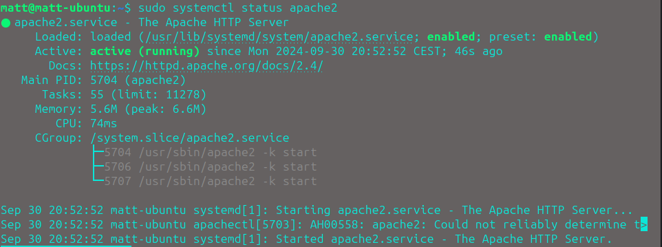
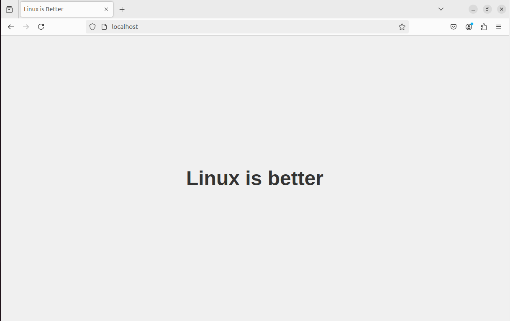
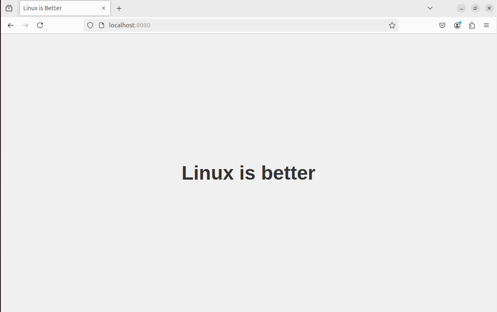
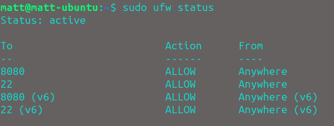
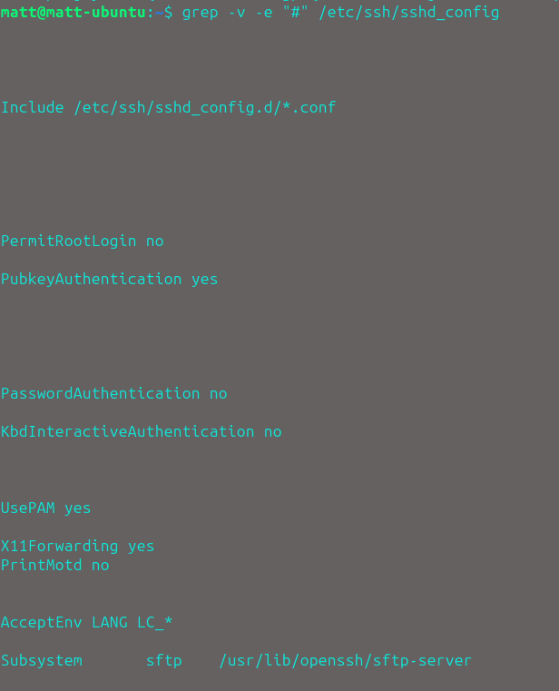

# TP 1

## **1. Installation et configuration d’un serveur web**

a. Installer Apache, lancer le service et vérifier son statut.

Dans un premier temps nous allons exécuter les commandes suivantes pour installer, lancer le service et vérifier son statut : 

- `sudo apt update && sudo apt install apache2 -y`
- `sudo systemctl start apache2`
- `sudo systemctl enable apache2`

Pour vérifier si le serveur est actif, utilisons la commande suivante :

- `sudo systemctl status apache2`

Nous pouvons voir dans ce cas que le serveur est bien en ligne : 



---

b. Configurer le serveur pour servir une page web simple :

```html
<!DOCTYPE html>
<html lang="en">
<head>
    <meta charset="UTF-8">
    <meta name="viewport" content="width=device-width, initial-scale=1.0">
    <title>Linux is Better</title>
    <style>
        body {
            background-color: #f0f0f0;
            margin: 0;
            height: 100vh;
            display: flex;
            justify-content: center;
            align-items: center;
            font-family: Arial, sans-serif;
        }
        h1 {
            color: #333;
            font-size: 48px;
            text-align: center;
            animation: fadeIn 2s ease-in-out;
        }
        @keyframes fadeIn {
            from { opacity: 0; }
            to { opacity: 1; }
        }
    </style>
</head>
<body>
    <h1>Linux is better</h1>
</body>
</html>
```

Changeons le index.html de /var/www/html pour afficher en local la page web que l'on souhaite.

Accédons d'abord à l'endroit où ce situe le index.html avec la commande :

- `cd /var/www/html`

Ensuite éditons le html en le remplaçant par le code ci dessus :

- `sudo nano index.html`

Nous devons relancer le service pour que les modifications prennent lieux : 

- `sudo systemctl restart apache2`

---

c. Vérifier que le serveur est accessible localement via un navigateur.

Nous pouvons vérifier que notre site est accessible localement en naviguant sur http://localhost, nous accédons donc au site web : 



d. Modifier la configuration pour que le serveur réponde sur un port non standard (ex: 8080)

Accédons à la configuration des ports du serveur : 

- `sudo nano /etc/apache2/ports.conf`

Changer le "Listen 80" en "Listen 8080"

Utilisez les commandes suivantes pour authoriser le trafic sur ce port en utilisant le protocole TCP et redémarrer le service :

- `sudo ufw allow 8080/tcp`

- `sudo systemctl restart apache2`

Pour accéder au site web après avoir changé le port sur lequel il est hébergé, il faut naviguer que l'url suivante
http://localhost:<nouveau_port>

Nous devrions voir notre site web : 



## **2. Configuration du pare-feu avec UFW**

Configurer un pare-feu pour n’autoriser que les connexions sur le port du serveur web (ex : 8080) et SSH (port 22).

Utilisons les commandes suivantes pour authoriser que les connexions sur le serveur web : 

- `sudo sudo ufw allow 8080/tcp`

- `sudo ufw allow 22/tcp`

- `sudo systemctl enable apache2`

Avec la commande  `sudo ufw status`, on peut vérifier quels ports sont ouvert :



## **3. Sécurisation des connexions SSH**

a. Configurer votre vm pour accepter que les connexions via clefs ssh

Pour ce faire nous allons avoir besoin d'abord de générer une clé ssh  : 

- `ssh-keygen -t rsa -b 4096`

Ensuite copions la clef publique sur le serveur distant : 

- `ssh-copy-id <user>@<IP_MACHINE>`

Connectons nous au serveur distant via ssh : 

- `ssh <user>@<IP_MACHINE>`

Cette commande permet de te connecter au serveur distant en utilisant ton authentification par clé SSH.

b. Désactiver le login de l’utilisateur root sur ssh

Modification du fichier de configuration SSH (ssh_config) :

- `sudo nano /etc/ssh/sshd_config`

Changer les lignes `#PermitRootLogin yes` et `#PasswordAuthentication yes` en
`PermitRootLogin no` et `PasswordAuthentication no`

Effectuons un `grep -v -e "#" /etc/ssh/ssh_config` pour rechercher dans le fichier les seules lignes qui ne sont pas en # et vérifier notre configuration :



Bien joué à tous ! 

## **4. BONUS**

Faites un script bash qui fait toutes vos commandes pour arriver au même statut que vous à la fin de l’étape 3.B

```bash
!/bin/bash

# Vérification si le script est exécuté en tant que root
if [[ $EUID -ne 0 ]]; then
   echo "Ce script doit être exécuté en tant que root." 1>&2
   exit 1
fi

# 1. Mise à jour du système
echo "Mise à jour du système..."
apt update && apt upgrade -y

# 2. Installation d'Apache
echo "Installation d'Apache..."
apt install apache2 -y

# 3. Démarrer Apache et vérifier son statut
echo "Démarrage d'Apache..."
systemctl start apache2
systemctl enable apache2

echo "Vérification du statut d'Apache..."
systemctl status apache2

# 4. Configuration d'Apache pour écouter sur le port 8080
echo "Configuration d'Apache pour écouter sur le port 8080..."
echo 'Listen 8080' >> /etc/apache2/ports.conf
cat <<EOL > /etc/apache2/sites-available/000-default.conf
<VirtualHost *:8080>
    DocumentRoot /var/www/html
    <Directory /var/www/html>
        AllowOverride All
    </Directory>
</VirtualHost>
EOL

# 5. Création d'une page web simple
echo "Création d'une page web simple..."
echo '<!DOCTYPE html>
<html lang="en">
<head>
    <meta charset="UTF-8">
    <meta name="viewport" content="width=device-width, initial-scale=1.0">
    <title>Linux is Better</title>
    <style>
        body {
            background-color: #f0f0f0;
            margin: 0;
            height: 100vh;
            display: flex;
            justify-content: center;
            align-items: center;
            font-family: Arial, sans-serif;
        }
        h1 {
            color: #333;
            font-size: 48px;
            text-align: center;
            animation: fadeIn 2s ease-in-out;
        }
        @keyframes fadeIn {
            from { opacity: 0; }
            to { opacity: 1; }
        }
    </style>
</head>
<body>
    <h1>Linux is better</h1>
</body>
</html>' > /var/www/html/index.html

# 6. Redémarrer Apache pour appliquer les modifications
echo "Redémarrage d'Apache pour appliquer les modifications..."
systemctl restart apache2

# 7. Configuration du pare-feu avec UFW
echo "Configuration du pare-feu..."
ufw allow 8080/tcp
ufw allow 22/tcp
ufw enable

# 8. Sécurisation des connexions SSH
echo "Sécurisation des connexions SSH..."
ssh-keygen -t rsa -b 4096
ssh-copy-id <user>@<IP_MACHINE>
ssh <user>@<IP_MACHINE>
# Désactiver le login root via SSH
echo "Désactivation du login de l'utilisateur root sur SSH..."
echo "PermitRootLogin no" >> /etc/ssh/sshd_config
echo "PubkeyAuthentification yes" >> /etc/ssh/ssh_config
echo "PasswordAuthentification no" >> /etc/ssh/ssh_config
systemctl restart sshd

# 9. Affichage de l'URL de l'application
echo "Serveur web configuré et accessible sur http://localhost:8080"

echo "Configuration terminée avec succès !"
```